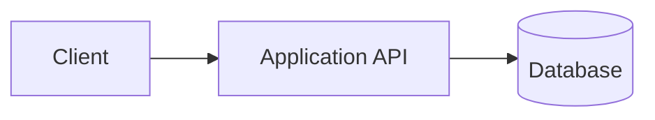

---
description: Adds or updates a Mermaid architecture diagram in README.md.
disable-model-invocation: true
------------------------------

# Add Mermaid architecture diagram

## Context

!`git status --short`
!`ls`

## Instructions

Add or update the `## Architecture` section in `README.md`.

Use only repository evidence. Do not read the full git diff unless necessary. Inspect only files needed to identify the app entrypoint, clients, modules, backing services, migrations, and API docs.

Prefer these files when present:

* `README.md`
* `go.mod`, `pyproject.toml`, `requirements*.txt`
* `Makefile`
* `.env.example`
* `docker-compose*.yml`
* `cmd/**`, `internal/**`, `pkg/**`
* `app/**`, `src/**`
* `db/migrations/**`, `migrations/**`
* `docs/**`

## Diagram requirements

Use Mermaid in Markdown:

```mermaid
flowchart LR
```

The diagram should show only what can be inferred from the repository:

* Clients, using generic names if specific clients are not found.
* Main API/application component.
* Main internal modules, only if clear.
* Backing services such as PostgreSQL/PostGIS, Redis, MongoDB, object storage, queues, or external APIs.
* Migrations to database relation, if migrations exist.
* Swagger/OpenAPI relation, if API docs exist.

Do not invent services, clients, queues, workers, gateways, or external integrations.

Prefer 6 to 12 nodes. Use short labels. Use actual Docker Compose service names when available. Use `subgraph` only if it improves readability.

## README section format

Use this structure:

````md
## Architecture

Short factual paragraph explaining the application architecture.



Main flow:

1. Clients call the API.
2. The API routes requests through handlers/controllers.
3. The app uses backing services for persistence, cache, or integrations.
````

Adapt the example to the actual repository.

## Output requirements

* Update `README.md` in place.
* Do not create a separate diagram file.
* Do not duplicate an existing architecture section.
* Keep Mermaid syntax valid.
* Keep the section factual and practical.
* Do not include Claude/AI attribution.
* End with a short summary of what changed and what could not be inferred.
